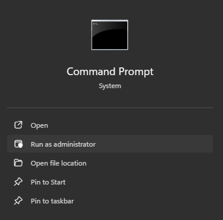
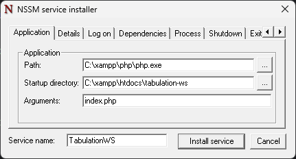

## TabulationWS Windows Service
Run the Tabulation WebSocket Server as a Windows Service

### Requirements
- **64-bit Windows OS**
- **PHP 8.0** or newer (make sure **php.exe** is in your [system PATH](https://stackoverflow.com/questions/31291317/php-is-not-recognized-as-an-internal-or-external-command-in-command-prompt))

---

### Installing the Service (Port: 8080)
To run the WebSocket server as a background Windows service,
you'll use [NSSM (Non-Sucking Service Manager)](https://nssm.cc/)
to wrap your PHP script into a manageable service.
Follow these steps to install it properly:
1. Open Command Prompt as Administrator.
   

2. Navigate to the NSSM ([deploy/windows/nssm-2.24-101-win64](nssm-2.24-101-win64)) directory:
   Example (if the `tabulation-ws` project is stored inside `C:\xampp\htdocs`):
   ```
   cd C:\xampp\htdocs\tabulation-ws\deploy\windows\nssm-2.24-101-win64
   ```

3. Run this command to open the NSSM installer:
   ```
   nssm install TabulationWS
   ```

4. In the NSSM GUI, fill in the following:

   - **Path:** _Full path to your php.exe_;
       
      Example: `C:\xampp\php\php.exe`    

   - **Startup directory:** The folder where `tabulation-ws` is
   
     Example: `C:\xampp\htdocs\tabulation-ws`

   - **Arguments:** `index.php`

   

   This runs the WebSocket server on **port 8080**.

   _**Note:** Update your WebSocket URL in the `app/config/websocket.php` of the tabulation software to use port **8080**._

5. In the NSSM GUI, click **Install service** to finish setup.

6. In the Command Prompt, start the service with:
   ```
   net start TabulationWS
   ```
   
   _**NOTE:** The service will also auto-start on system boot._

---

### Managing the Service
To manage the TabulationWS service,
open **Command Prompt as Administrator**.
You can use the following commands to control the service:

- **Start the service:**
  ```
  net start TabulationWS
  ```

- **Stop the service:**
  ```
  net stop TabulationWS
  ```

- **Restart the service:**
  ```
  net stop TabulationWS && net start TabulationWS
  ```

- **Check service status:**
  ```
  sc query TabulationWS
  ```

- **Remove the service:**
  
  To remove or uninstall the service, navigate to the NSSM ([deploy/windows/nssm-2.24-101-win64](nssm-2.24-101-win64)) directory again and enter:
  ```
  nssm remove TabulationWS confirm
  ```